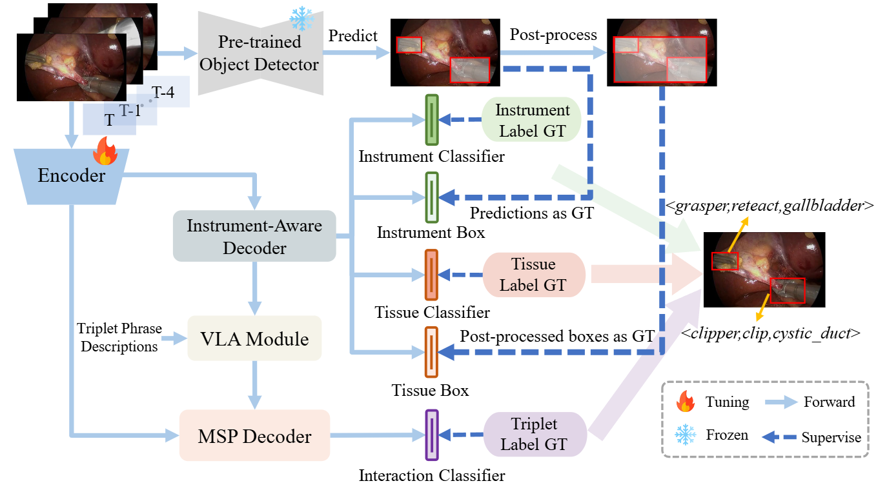
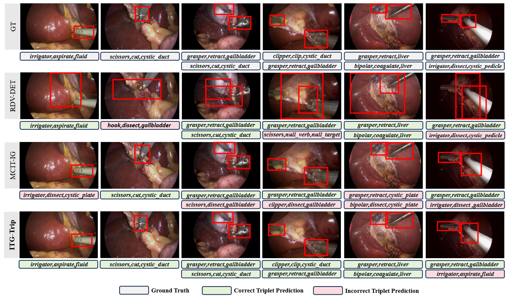

#z[TMI'25] Instrument-Tissue-Guided Surgical Action Triplet Detection via Textual-Temporal Trail Explorati

<p align="center">

</p>

Official Implementation of "[Instrument-Tissue-Guided Surgical Action Triplet Detection via Textual-Temporal Trail Exploration](https://ieeexplore.ieee.org/stamp/stamp.jsp?tp=&arnumber=11084985)". 

[Jialun Pei](https://scholar.google.com/citations?user=1lPivLsAAAAJ&hl=en), [Jiaan Zhang](), [Guanyi Qin](https://scholar.google.com/citations?hl=zh-CN&user=Sq5AJxgAAAAJ&view_op=list_works&sortby=pubdate), [Kai Wang](https://www.researchgate.net/scientific-contributions/Kai-Wang-2079876800), [Yueming Jin](https://scholar.google.com/citations?user=s_kbB4oAAAAJ&hl=zh-CN), [Pheng-Ann Heng](https://scholar.google.com/citations?user=OFdytjoAAAAJ&hl=zh-CN).

[]([https://ieeexplore.ieee.org/stamp/stamp.jsp?arnumber=11016089](https://ieeexplore.ieee.org/stamp/stamp.jsp?tp=&arnumber=11084985))

## Qualitative results

<p align="center">

</p>

## Installation

Conda virtual environment

We recommend using conda to setup the environment.

We tested the code on python 3.8 and pytorch '1.10.1+cu111'.

Installl the dependencies.
```
pip install -r requirements.txt
```
Clone and build CLIP.
```
git clone https://github.com/openai/CLIP.git && cd CLIP && python setup.py develop && cd ..
```
Install causal_conv1d and mamba
```
pip install -e causal_conv1d>=1.1.0
pip install -e mamba-1p1p1
```
## Register Datasets

Download the cholect50 dataset, you can download it here [cholect50](https://github.com/CAMMA-public/cholect50).

The downloaded annotation files should be placed as follows.

```
├── CholecT50 Dataset
    ├── images
    │   ├── train/
    │   │   ├── VID01/
    |   |   |    ├──000000.png
    |   |   |    ├──000001.png
    |   |   |    ...
    │   │   ├── VID02/
    │   │   ...
    │   │   └── VID80/
    ├── annotations
    │   └── train.json
 ```

## Train

After the preparation, you can start training with the following commands.

```
sh ./config/hico_s.sh
```

## 📚 Citation

If this helps you, please cite this work:

```bibtex
@article{pei2025str,
  title={Instrument-Tissue-Guided Surgical Action Triplet Detection via Textual-Temporal Trail Exploration},
  author={Pei, Jialun and Zhang, Jiaan and Qin, Guanyi and Wang, Kai and Jin, Yueming and Heng, Pheng-Ann},
  journal={IEEE Transactions on Medical Imaging},
  year={2025}
}
```

## Acknowledgment

This work is based on [GEN-VLKT](https://github.com/YueLiao/gen-vlkt). Thanks for their great work and contributions to the community!
